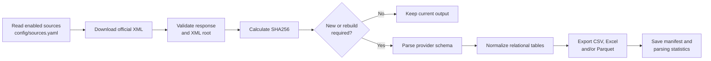

# Sanctions Data Manager

<p align="center">
  <strong>Download, validate, normalize, and export official sanctions data from one friendly terminal application.</strong>
</p>

<p align="center">
  
  
  
  
</p>

---

## What is this project?

Sanctions Data Manager is a Python framework for acquiring and normalizing
public sanctions lists published by four official authorities:

| Key | Authority | Coverage |
| --- | --- | --- |
| `ofac` | U.S. Office of Foreign Assets Control | Specially Designated Nationals and related records |
| `un` | United Nations Security Council | UN Consolidated Sanctions List |
| `eu` | European Union | EU Financial Sanctions Files |
| `uk` | UK Foreign, Commonwealth & Development Office | UK Sanctions List |

The providers publish different XML structures. This project downloads each
official feed and converts it into the same set of relational tables, making
names, aliases, addresses, documents, programs, sanctions, and other attributes
much easier to review or load into an analytics system.

It was designed for a recurring operational workflow—such as a monthly list
refresh—without asking the operator to manually find or download XML files.

> [!IMPORTANT]
> This project organizes public source data. It is not a complete screening
> engine and does not provide legal or compliance advice. Production screening
> still requires matching rules, review procedures, audit controls, and expert
> oversight appropriate to your organization.

## What happens during a run?



For each selected provider, the application:

1. Reads its URL and settings from `config/sources.yaml`.
2. Streams the latest XML from the official provider.
3. Follows redirects and retries transient failures.
4. Rejects empty, invalid, or unexpected XML responses.
5. Stores the raw source file under a date-based archive.
6. Calculates a SHA256 checksum.
7. Reuses current results when both the source content and parser schema match.
8. Parses new or rebuild-required data with the provider-specific parser.
9. Exports consistent relational datasets and a run manifest.

One provider failing does not stop the other selected providers from running.
Technical details are retained in `logs/run.log`.

## Quick start on Windows

The easiest handoff requires no command-line knowledge.

### First-time setup

1. Install **64-bit Python 3.11, 3.12, 3.13, or 3.14** from
   [python.org](https://www.python.org/downloads/windows/).
2. During Python installation, select **Add python.exe to PATH**.
3. Download or clone this repository.
4. Double-click **`SETUP.bat`** once.
5. Double-click **`RUN_APP.bat`** whenever you want to use the application.

`SETUP.bat` creates an isolated `.venv`, installs the required packages, and
verifies the source configuration. `RUN_APP.bat` automatically launches setup
if the environment is missing or needs a dependency update.

```powershell
git clone https://github.com/Vishukk1503/sanctions-parser.git
cd sanctions-parser
.\SETUP.bat
.\RUN_APP.bat
```

### Managed Windows networks

The application uses Windows' native certificate trust store for HTTPS. This
allows it to work securely on managed PCs where approved products such as Palo
Alto GlobalProtect inspect HTTPS traffic using a corporate certificate installed
by IT.

Certificate and hostname verification remain enabled. The application does not
use the insecure `verify=False` workaround. If an existing installation predates
this support, rerun `SETUP.bat` once to install the required `truststore`
dependency before launching `RUN_APP.bat`.

## Interactive application

Running `RUN_APP.bat` or `python main.py` opens the keyboard-driven interface:

```text
SANCTIONS DATA MANAGER
Automated acquisition • validation • normalization

What would you like to do?
  1) Run all enabled sources
  2) Select sources to process
  3) View parsing reports
  4) Troubleshoot
  5) Open output folder
  6) Exit
```

The interface lets an operator:

- process every provider or select only the required providers;
- choose one export format or all available formats;
- return to the main menu after each completed action;
- review record, entity-type, alias-quality, and field-coverage counts;
- open the output directory directly;
- inspect live and local health without downloading an entire file.

### Health & Uplink Dashboard

The dashboard combines network and dataset checks in one view:

- provider availability, HTTP status, redirect count, and response time;
- expected XML-root verification;
- live source date compared with the locally archived source date;
- raw XML presence and file size;
- parser-version and rebuild status;
- current output and last-run status;
- clear issue summaries while cached data remains available.

It is a diagnostic view only; it does not replace or modify output files.

### Parsing reports

The **View parsing reports** menu shows the latest current statistics for one
provider or all providers, including:

- total entities;
- individuals, organizations, vessels, aircraft, and other entity types;
- total aliases;
- strong, weak, and former alias counts;
- addresses, documents, nationalities, programs, and dates of birth;
- relationships, birth places, designations, regulations, contacts, and
  sanctions.

## Output structure

The application keeps provider source files and normalized outputs separate:

```text
sanctions-parser/
├── config/
│   └── sources.yaml
├── raw/
│   └── <source>/
│       └── YYYY-MM-DD/
│           └── provider-file.xml
├── output/
│   └── <source>/
│       └── YYYYMMDDTHHMMSSZ/
│           ├── csv/
│           │   ├── entity.csv
│           │   ├── alias.csv
│           │   └── ...
│           ├── excel/
│           │   └── sanctions.xlsx
│           ├── parquet/
│           │   ├── entity.parquet
│           │   ├── alias.parquet
│           │   └── ...
│           └── manifest.json
└── logs/
    └── run.log
```

Only directories for the export formats selected by the operator are created.
Previous raw XML versions remain archived instead of being overwritten.

### Normalized tables

Every provider is exported through the same stable table set:

| Table | Main contents |
| --- | --- |
| `entity` | Source ID, entity type, primary name, status, comments, and list dates |
| `alias` | One alias per row with quality and language metadata |
| `address` | Address text, country, city, and postal code |
| `document` | Document number, type, issuing country, dates, and notes |
| `nationality` | Nationalities linked to an entity |
| `program` | Sanctions programs or regimes |
| `relationship` | Related parties and relationship types |
| `date_of_birth` | Birth dates and related place details |
| `place_of_birth` | Structured birth places |
| `designation` | Titles, positions, or designations |
| `regulation` | Relevant regulatory instruments and publication details |
| `contact` | Phone, email, website, and other contact values |
| `sanction` | Sanction measures and classifications |

Every child table links back to `entity.entity_id`. Empty tables are still
emitted with their correct columns so downstream loaders receive a predictable
schema.

### Excel `name+alias` sheet

Each Excel workbook also contains a convenience sheet named **`name+alias`**.
It keeps one row per entity and places the primary name and that entity's
Latin-script aliases together.

Aliases are ordered by quality:

1. strong;
2. weak;
3. former.

The sheet includes a distinct alias count. Multiple aliases are kept in one
readable `aliases` cell, separated with `|` and tagged as `[strong]`, `[weak]`,
or `[former]`. The normalized `alias` sheet remains the authoritative
one-alias-per-row representation for database loading and analysis.

### `manifest.json`

Each completed output directory includes a machine-readable manifest containing:

- source name and raw-file path;
- SHA256 source checksum;
- parser schema version;
- selected export formats;
- row count for every normalized table;
- the parsing-summary counts displayed in the report menu.

The manifest is how the application determines whether an existing export is
complete and compatible with the current parser.

## Change detection and monthly refreshes

The checksum answers a narrow question: **are the downloaded XML bytes the same
as the most recently processed source?**

- Same checksum + same parser schema + complete requested exports: parsing is
  skipped safely.
- Same checksum + newer parser schema: output is rebuilt using the improved
  parser.
- Same checksum + missing requested format: the cached raw XML is parsed to
  create the missing output.
- New checksum: the new raw XML is archived, parsed, and exported.
- Failed download: the error is logged and other providers continue.

This means deleting a generated output does not permanently block processing,
and unchanged provider data does not create needless duplicate exports.

## Configuration

All download endpoints and network defaults live in `config/sources.yaml`:

```yaml
defaults:
  timeout_seconds: 120
  retries: 3
  user_agent: "sanctions-parser/1.0"
  chunk_size: 1048576

sources:
  ofac:
    enabled: true
    url: "https://official-provider.example/list.xml"
    parser: ofac
    expected_root: sdnList
```

URLs are not hard-coded in the downloader. A source can be enabled, disabled,
or redirected to a new official endpoint through configuration.

Adding a provider with a completely different XML schema also requires a parser
function in `sanctions_parser/parsers.py` and a registration in `PARSERS`.
Configuration can describe where a feed is located, but it cannot define the
meaning of an unknown provider schema by itself.

## Command-line use

The interactive interface is the default:

```powershell
python main.py
```

Run all enabled providers without opening the menu:

```powershell
python main.py --non-interactive
```

Process one or several named providers:

```powershell
python main.py --source ofac
python main.py --source ofac --source uk
```

Use another configuration or enable detailed logging:

```powershell
python main.py --config path\to\sources.yaml
python main.py --non-interactive --verbose
```

The process returns a non-zero exit code when a selected provider fails, making
non-interactive execution suitable for Task Scheduler or another automation
tool.

## Manual development setup

```powershell
python -m venv .venv
.\.venv\Scripts\Activate.ps1
python -m pip install -r requirements-dev.txt
python main.py
```

On Linux or macOS, activate the environment with
`source .venv/bin/activate`.

### Validation

```powershell
pytest
ruff check .
black --check .
python -m pip check
```

## Project map

| Path | Responsibility |
| --- | --- |
| `main.py` | Program entry point, arguments, logging, and run orchestration |
| `sanctions_parser/config.py` | YAML configuration loading and validation |
| `sanctions_parser/downloader.py` | Streaming HTTP download, retries, XML validation, and checksums |
| `sanctions_parser/parsers.py` | OFAC, UN, EU, and UK schema-specific normalization |
| `sanctions_parser/models.py` | Stable relational data models |
| `sanctions_parser/exporter.py` | CSV, Excel, and Parquet generation |
| `sanctions_parser/pipeline.py` | End-to-end source workflow and manifest management |
| `sanctions_parser/interactive.py` | Rich terminal menus, summaries, and reports |
| `sanctions_parser/health.py` | Uplink, freshness, raw-file, parser, and output checks |
| `sanctions_parser/reporting.py` | Stored parsing-statistics retrieval |
| `tests/` | Automated configuration, download, parser, pipeline, export, UI, and report tests |

## Operational notes

- The official providers remain the source of truth.
- Provider URLs and XML schemas can change; review dashboard warnings and
  `logs/run.log` when a source fails.
- Do not manually edit archived raw XML if reproducibility matters.
- Do not treat entity IDs as universal across providers.
- Preserve `manifest.json` with each output when handing datasets downstream.
- Raw XML and generated output are intentionally excluded from Git because they
  can be large and can always be acquired or regenerated by the application.

---

<p align="center">
  Built to turn four different official sanctions feeds into one predictable,
  reviewable data workflow.
</p>
